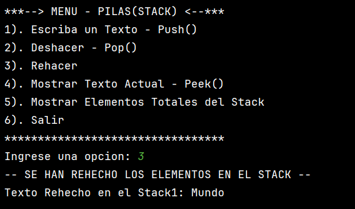

# Actividad-Pilas-Stack-
Aplicar en un simulador los conceptos para deshacer/rehacer (Undo/Redo) en un editor de texto simple, 
implementado en Java, trabajando en equipo y utilizando buenas prácticas de control de versiones con GitHub.

-> **¿Qué es una PILA (STACK)**

Las pilas son estructuras de tipo LIFO, lo cual quiere decir que el último elemento añadido 
es siempre el primero en salir.

-> **Cómo se Aplica al programa**

- stack1 ` se usa como la pila principal: cada vez que el usuario hace **Push**, el texto se guarda en ` stack1.
- Cuando el usuario selecciona **Deshacer (Pop)**, el elemento superior de `stack1` se remueve (`pop`) 
y se inserta en `stack2` (la pila de “Redo”).
- Si luego el usuario selecciona **Rehacer**, se saca (`pop`) de `stack2` y se envía de vuelta a `stack1`.
- `Peek` permite ver el elemento actual que está en el tope de `stack1` sin removerlo.

# INTEGRANTES DEL GRUPO 

* `Sara Gabriela Castro Mora`
* `Santiago Pérez Pino`

# OBJETIVO DE LA ACTIVIDAD 

Aprender a implementar los conceptos de pilas (Stack), conocer
que conocer cada uno de sus principales métodos como lo son:
* `Push()` = Añade datos a la Pila
* `Pop()` = Elimina datos de la pila
* `Peek()` =  Muestra el elemento de arriba
* `isEmpty()` = Pregunta si está vacio

Así mismo desarrollar un menú interactivo donde el usuario pueda
digitar las opciones que desea realizar dentro del programa. Esto con 
el fin visualizar los datos y el correcto funcionamiento de la Pila(Stack)
en el programa, por medio del trabajo colaborativo de los diferentes 
integrantes del equipo de desarrollo por medio del control de 
versiones (Github) del proyecto.

 # INSTRUCCIONES DE EJECUCIÓN

1. Ejecutar el programa
2. Usar el menú interactivo
3. Opciones disponibles
4. 
        * Opción 1 → Push:
          Escribes un texto y se guarda en el stack1. 
        * Opción 2 → Pop:
          Te pregunta si quieres eliminar el último texto ingresado.
          Si respondes S, el texto se pasa a stack2 (deshacer).
          Si respondes N, no elimina nada.
        * Opción 3 → Rehacer:
          Si has eliminado algo (está en stack2), puedes restaurarlo a stack1.
        * Opción 4 → Peek:
          Muestra el texto más reciente en stack1.
        * Opción 5 → Mostrar todos los elementos:
          Lista todos los elementos en stack1.
        * Opción 6 → Salir:Termina el programa
5. Ejemplo de ejecución
   1. `Seleccionas la opción 1 y escribes "Hola".` 
   2. `Seleccionas la opción 1 otra vez y escribes "Mundo".` 
   3. `El stack1 ahora tiene: [Hola, Mundo]`
   4. `Seleccionas la opción 2 y confirmas con "S".` 
   5. `Se elimina "Mundo" y pasa a stack2.` 
   6. `Seleccionas la opción 3 (rehacer).`
   7. `"Mundo" vuelve a stack1.` 
   8. `Seleccionas la opción 5.` 
   9. `Muestra: [Hola, Mundo].`

# CAPTURAS DE LA EJECUCIÓN 

# DESARROLLO DE LA ACTIVIDAD 

* Hicimos una descomposicion de los requisitos de la actividad
para saber que funcionalidades debia de tener el programa.
* Se realizarón funciones para cada uno de los metodos principales 
de las Pilas(Stack).
* Se implementó un menú para visualizar las opciones del programa.
* Se usó un switch case para capturar del dato de la consola y 
llamar a la función establecida.
* Utilizamos un do while para permitir realizar multiples
interacciones con el menú sin que la ejecución del programa se terminara.
* Realizamos las pruebas del codigo por medio del menú con los resultados
esperados.
* Realizamos las correcciones de los errores.
* Creamos un repositorio de Github.
* Trabajo colaborativo con el equipo de desarrollo.
* Delegamos tareas entre el equipo de desarrollo.
